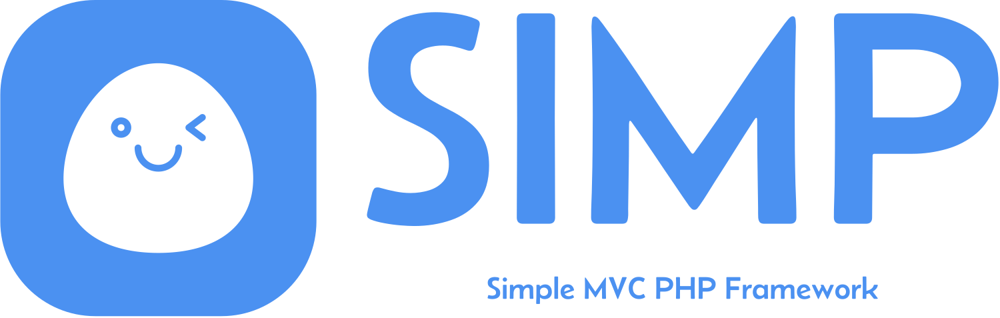

# Simple MVC PHP Framework



## Overview

Welcome to the Simple MVC PHP Framework! This framework is a simple, dependency-free PHP MVC framework designed to help you get started with a clean project structure and proper routing.

## Features

- **Vanilla PHP**: No external dependencies.
- **Clean Structure**: Organize your code with a simple MVC pattern.
- **Proper Routing**: Move beyond traditional file-based routing.

## Note

Still under development

## Installation

1. Clone the repository:

   ```bash
   git clone https://github.com/nurbxfit/simp-framework.git
   ```

2. Navigate to the project directory:

   ```bash
   cd simp-framework
   ```

## Development Setup Instructions

There are two ways to run the development environment:

1. **Using Docker Compose**:
   Run the following command in the root of the repository:

   ```sh
   docker-compose up --build
   ```

   To Stop the container:

   ```
   ctrl + c
   ```

   or stop it using docker desktop GUI.

   To remove the container, can run this command:

   ```sh
   docker-compose down
   ```

2. **OR Using Individual scripts**:

   - navigate to `www` folder and run the script :

   ```
   ./docker-run.sh
   ```

   - navigate to `nginx` folder and run the script :

   ```
   ./docker-run.sh
   ```

   - navigate to `db` folder and run the script :

   ```
   ./docker-run.sh
   ```

   - note: # if using windows run the .bat or .ps1 script

After you start the container, you can go to `http://localhost` to view it
When you refresh your browser, you will see the changes without having to restart the Docker container.

## Documentation

For detailed documentation, visit [Docs](https://github.com/nurbxfit/simp-framework/wiki).
